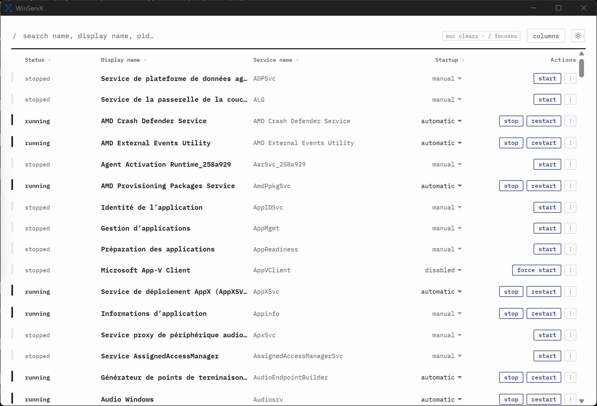

# WinServX

WinServX is a small Windows service action console. It is for the handful of
services I actually need to start, stop, restart, or reconfigure, rather than
for browsing every detail of the Service Control Manager.

This is an early `0.1.0` project.

## Why

On Windows, starting or stopping a service can take several seconds. When I
want to handle a few services, I do not want the interface to make me wait for
each one or block the rest of the work behind a modal. WinServX queues the
actions and keeps the UI responsive while Windows does its work.



[Watch the demo](docs/media/winservx-demo.mp4), showing service-name filtering,
multiple service actions, and startup type changes issued without blocking.

## What it does

- Filters services by service name, display name, or PID.
- Shows only the actions that make sense for a service's current state.
- Changes a service's startup type without leaving the main view.
- Queues actions so work can continue while slow services start or stop.
- Keeps failed actions visible in the queue instead of hiding them in a dialog.

## Windows

WinServX is Windows-only and talks to the Windows Service Control Manager.
Service actions may require administrator privileges. The app does not silently
elevate; permission failures are reported as queue failures.

## Build

You need [Node.js](https://nodejs.org/), [pnpm](https://pnpm.io/), Rust, and the
[Tauri Windows prerequisites](https://v2.tauri.app/start/prerequisites/).

```powershell
pnpm install
pnpm tauri dev
```

To build an installer:

```powershell
pnpm tauri build
```

WinServX is built with Tauri, Svelte, TypeScript, and Rust.
